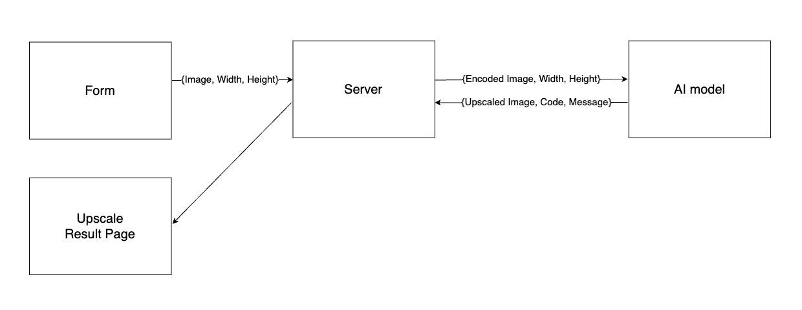

## 프로젝트 설명
- ai 모델과 통신해서 이미지 조정 기능을 제공하는 서버
- polling 방식으로 구현 변경 후 에러 처리 중
- 프론트엔드 없이 간단한 html 템플릿에서 이미지 가공 결과를 확인할 수 있도록 함

## 이미지 처리 흐름

## 프로토타입 이미지 처리 흐름 (현재 적용하지 않음)

## 접근 가능 url
### 웹앱
- https://freesize.vercel.app/

### swagger 문서
- https://freesize.pe.kr/swagger-ui/index.html

### 백엔드 기능 테스트 페이지
- https://freesize.pe.kr/test/upload
- 윗쪽 폼은 입력받은 이미지를 미리 설정해둔 비율로 업스케일한 결과를 보여줌
- 아랫쪽 폼은 입력받은 이미지를 미리 설정해둔 비율의 사면체 형태로 수정한 결과를 보여줌

